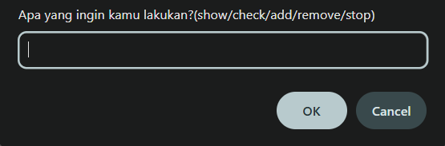
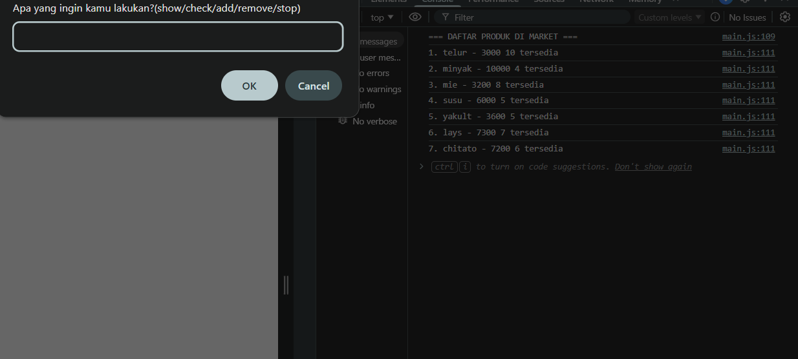
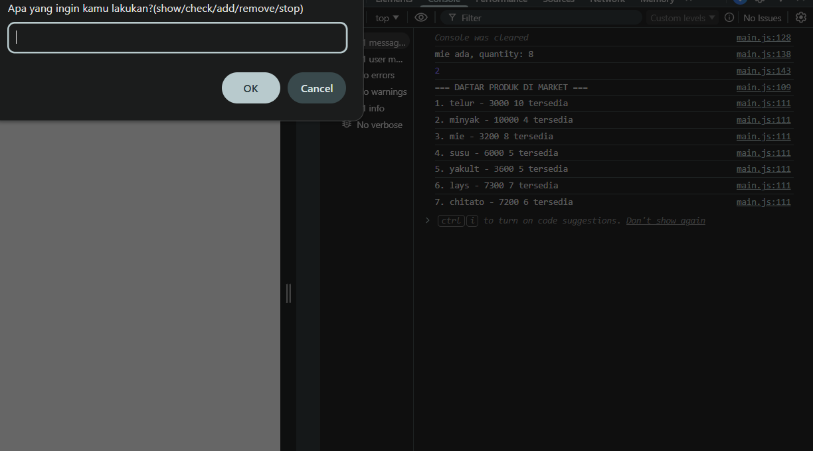
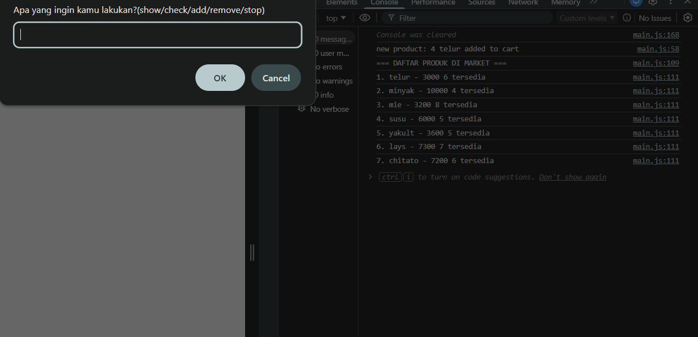
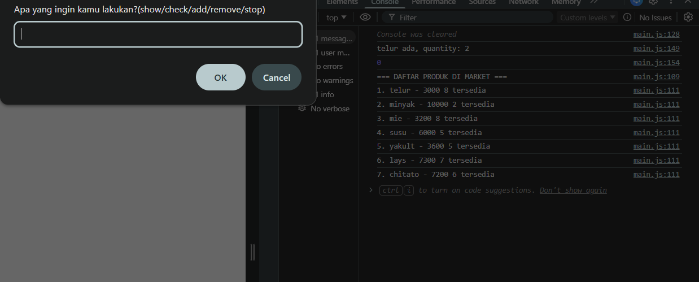
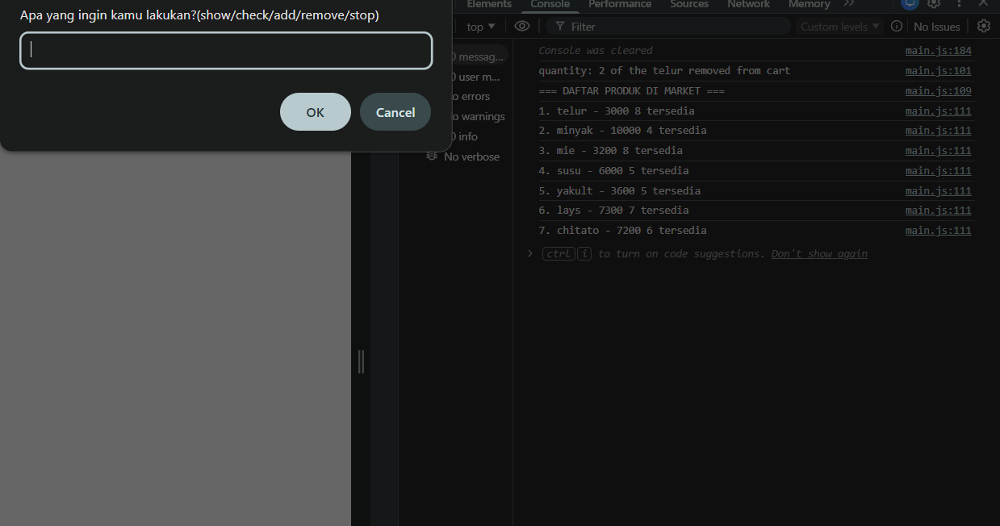
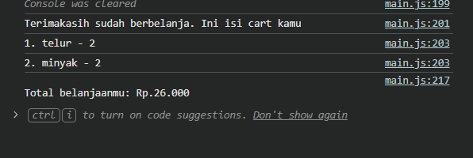

# Mini Kasir

Mini Kasir adalah aplikasi sederhana berbasis browser untuk melakukan proses belanja.

## Description

Mini Kasir merupakan aplikasi sederhana berbasis console yang dibuat untuk melatih Create-Read-Update-Delete (CRUD) Data menggunakan JavaScript.

User dapat melihat daftar barang yang tersedia di market, serta melihat daftar barang yang ada pada cart secara terupdate. user juga dapat menambahkan product ke cart dan menghapus product dari cart dengan kuantitinya. Semua data product disimpan sementara menggunakan array di JavaScript yang bernama cart, sehingga akan hilang ketika halaman di-refresh. Ketika dalam proses 'berbelanja' tersebut, user hanya bisa keluar dari program dengan cara mengetik 'stop' atau dengan merefresh halaman, hal itu diakibatkan oleh do-while loop.

## Features

- Validasi input sebelum data diproses
- Menambahkan product ke cart
- Menampilkan daftar product di cart dan market secara aktual
- Menghapus product dari cart
- Penyimpanan product sementara menggunakan array JavaScript
- Mencari product berdasarkan nama di cart dan market
- Keterangan jika stok habis, item tidak ditemukan, dan quantity pas (diborong habis)

## Tech Stack

- HTML
- CSS
- JavaScript

## Learning Focus

- CRUD operasi pada array of objects
- Mengelola dua array yang saling berhubungan (cart & dataProduct)
- Input validation sebelum data diproses
- Implementasi search / findIndex secara manual
- Edge case handling (stok habis, item tidak ditemukan, quantity pas)
- Do-While loop untuk interaksi yang terus berjalan hingga user stop

## How to Run

Clone repository:

git clone https://github.com/jatpifaiz/mini-kasir.git

Buka file "index.html" di browser.

## Preview

**First Action**

**Output Ketika Memilih Menu Show**

**Output Ketika Check Product di Market**

**Menambah Product ke Cart**

**Output Ketika Check Product di Cart**

**Menghapus Product dari Cart**

**Output Ketika Mengakhiri Porses Belanja**

## Author

Jatpi Faiz Intipadah
