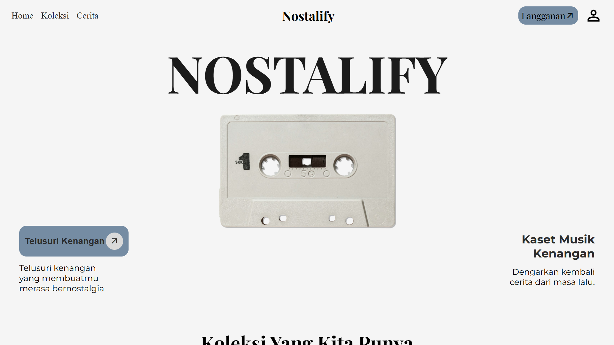
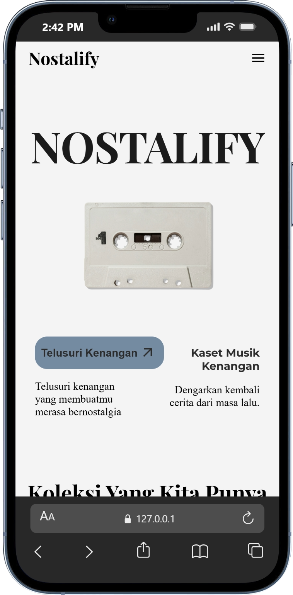
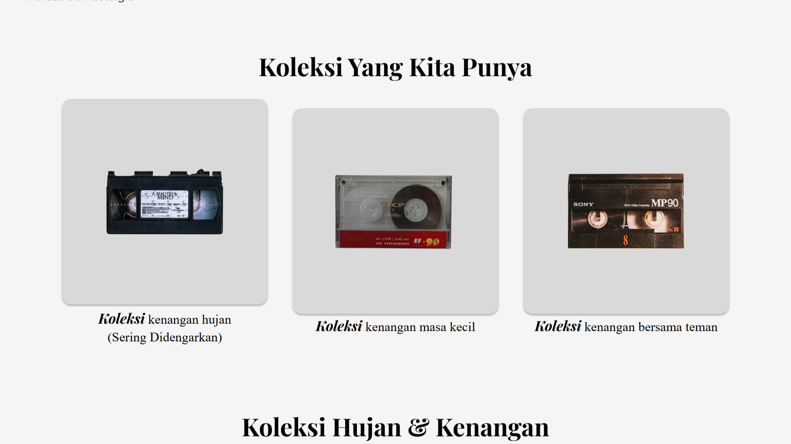
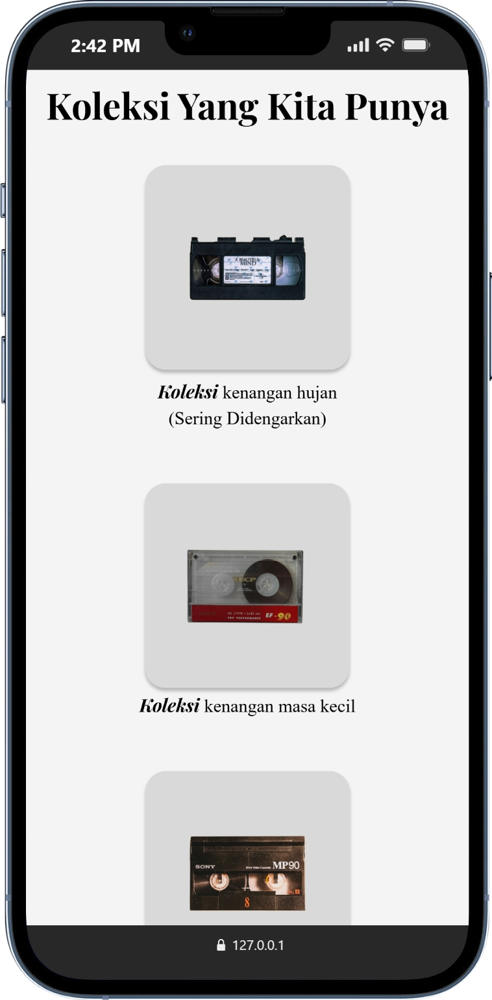
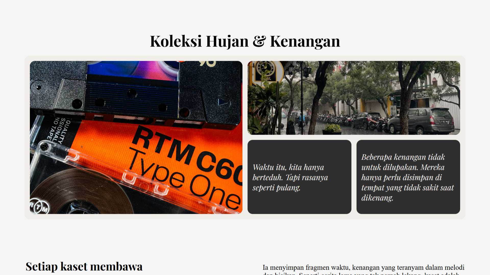
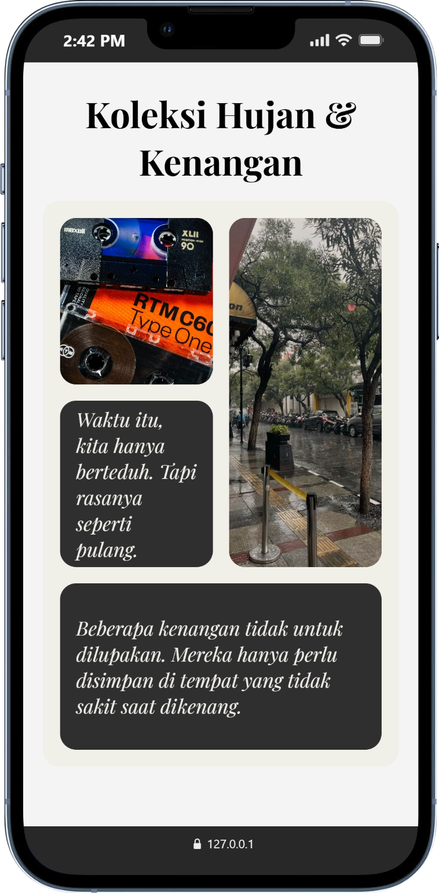
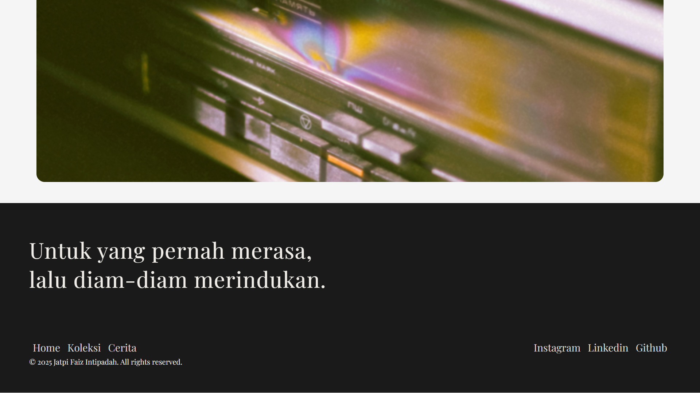
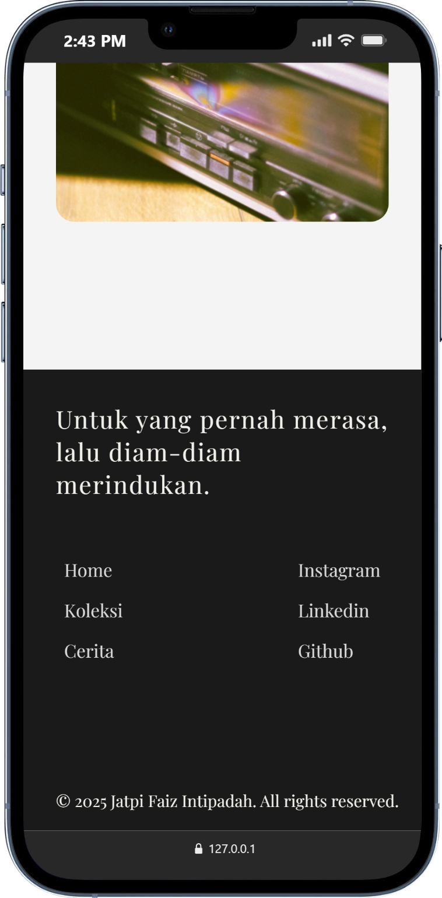

# Nostilify

Nostilify adalah website statis bertema nostalgia musik kaset yang menampilkan produk dummy (fiktif) untuk menciptakan pengalaman bernostalgia dengan era musik kaset.

## Description

Nostilify merupakan project website statis yang dibuat untuk melatih pembuatan layout website modern menggunakan HTML dan CSS. Website ini menampilkan konsep nostalgia terhadap musik kaset melalui beberapa section seperti hero, about, dan product showcase.

Produk yang ditampilkan pada website ini merupakan **produk dummy (fiktif)** yang digunakan sebagai media latihan untuk membangun layout, grid system, dan responsive design.

Project ini tidak menggunakan backend atau database dan berjalan sepenuhnya di browser.

## Features

- Navigation bar
- Hero section
- About section
- Responsive layout (desktop & mobile)
- Product Showcase (dummy cassette products)
- Bento grid layout
- Footer

## Tech Stack

- HTML
- CSS

## Learning Focus

- Layout website
- Layout menggunakan flexbox
- Layout menggunakan CSS grid
- Bento grid layout
- Responsive design
- Struktur section pada website

## How to Run

Clone repository:

git clone https://github.com/jatpifaiz/nostilify.git

Buka file "index.html" di browser.

## Preview

**Hero Section**

   

**About Section**

   

**One of Collection**

   

**Footer**

   

## Author

Jatpi Faiz Intipadah
