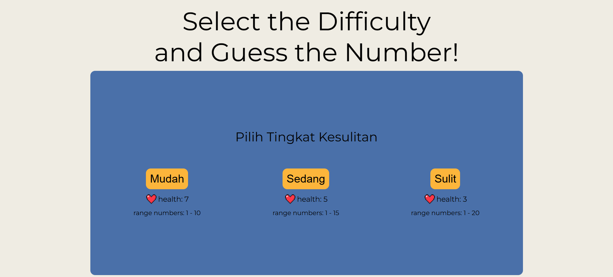
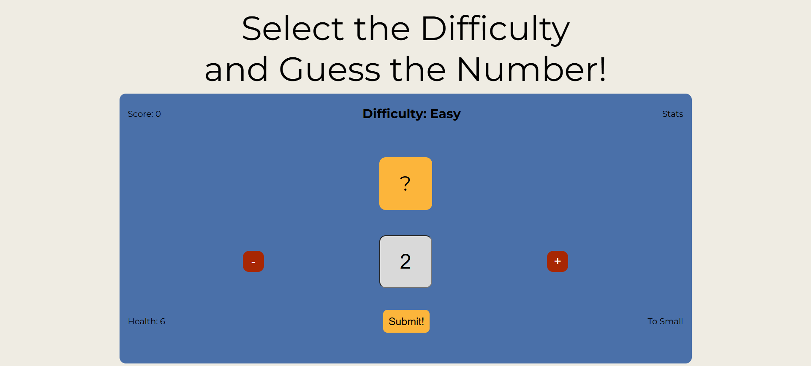

# Number Guessing Game

Game sederhana berbasis browser di mana pemain harus menebak angka yang dipilih secara acak oleh komputer.

## Description

Number Guessing Game adalah permainan sederhana yang dibuat untuk melatih logika pemrograman menggunakan JavaScript. Pemain harus menebak angka yang dipilih oleh komputer dalam rentang tertentu berdasarkan tingkat kesulitan yang dipilih.

Setiap tingkat kesulitan memiliki jumlah angka maksimum dan jumlah kesempatan yang berbeda. Pemain akan mendapatkan petunjuk apakah tebakan terlalu besar atau terlalu kecil sampai angka yang benar ditemukan atau kesempatan habis.

Project ini merupakan website statis yang berjalan sepenuhnya di browser tanpa backend atau database.

## Features

- Pemilihan tingkat kesulitan (Easy, Medium, Hard)
- Angka acak yang dihasilkan komputer
- Sistem health / kesempatan menebak
- Petunjuk tebakan (Too High / Too Small)
- Validasi input angka
- Reset game setelah menang atau kalah
- Kontrol angka menggunakan tombol increase / decrease

## Tech Stack

- HTML
- CSS
- JavaScript (Vanilla)

## Learning Focus

- Logika pemograman bahasa JavaScript
- Manipulasi DOM
- Event Handling (addEventListener)
- Game state management
- Validasi Input
- Struktur kode JavaScript untuk mini game

## How to Run

Clone repository:

git clone https://github.com/jatpifaiz/number-guessing-game.git

Buka file "index.html" di browser.

## Preview

**Level Selection**

**Game Guess Section**

## Author

Jatpi Faiz Intipadah
