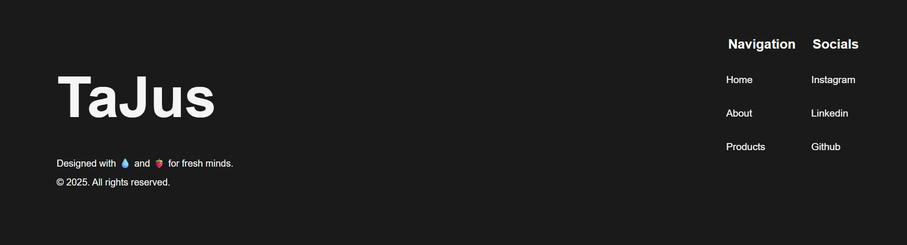

# TaJus

Website statis sederhana yang dibuat untuk latihan membuat struktur halaman dan layout website.

## Description

taJus adalah website simulasi usaha jus yang memiliki keunggulan, juga merupakan website statis yang berisi beberapa section seperti hero, about, dan product showcase. Pada website ini, tidak menggunakan backend atau database.

## Features

- Navigation Bar
- Hero Section
- About Section
- Product Showcase (Bento)
- Footer

## Tech Stack

- HTML
- CSS
- JavaScript

## Learning Focus

- Layout website
- Layout Bento
- Flexbox and CSS Grid
- Struktur section pada website

## How to Run

Clone repository:

git clone https://github.com/jatpifaiz/taJus.git

Buka file "index.html" di browser.

## Preview

**Hero Section**

**Bento Grid**

**Footer**

## Author

Jatpi Faiz Intipadah
